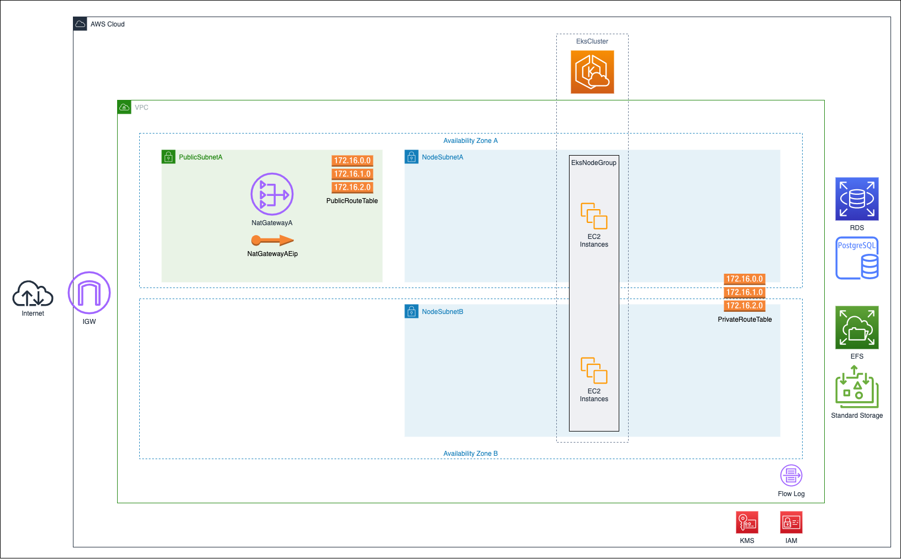
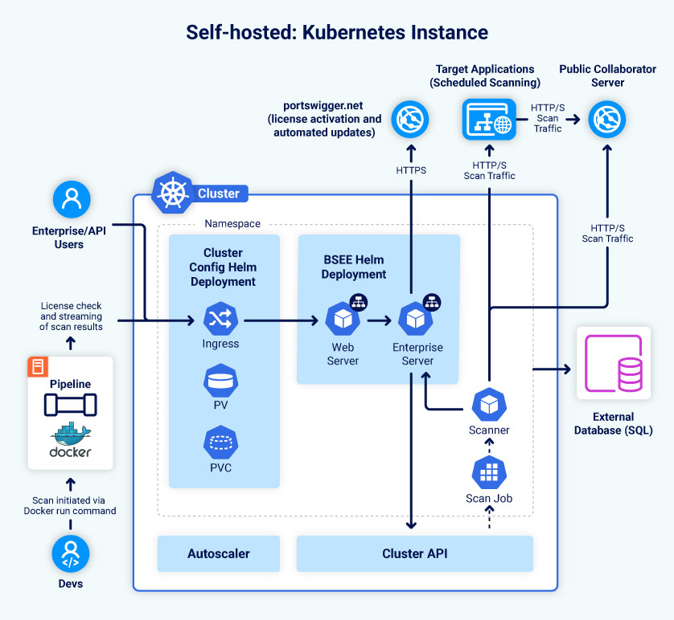

# AWS Reference Stack Implementation for Burp Suite Enterprise Edition

The AWS reference stack implementation for Burp Suite Enterprise Edition is an opinionated quick start template that
provisions a managed Kubernetes cluster ([EKS](https://aws.amazon.com/eks)) and prepares it for deployment of the Burp
Suite Enterprise Edition application. The reference stack also provisions a PostgreSQL database for convenience.

__This reference implementation is provided under the [Apache 2.0](LICENSE) license without warranty or liability.__

The reference implementation is broken into two layers, [Infrastructure Definition (CloudFormation template)](#infrastructure-definition-cloudformation-template)
and [Cluster Configuration (Helm chart)](#cluster-configuration-helm-chart).

## TL;DR;

### Prerequisites

* [AWS CLI](https://aws.amazon.com/cli/)
* [Kubectl](https://kubernetes.io/docs/tasks/tools/#kubectl)
* [Helm](https://helm.sh/docs/intro/install/)
* _TODO: AWS Permissions_

### Deploy the [Infrastructure Definition (CloudFormation template)](#infrastructure-definition-cloudformation-template)
```shell
DATABASE_POSTGRES_USERNAME=postgres
DATABASE_POSTGRES_PASSWORD=change_me

aws cloudformation deploy --stack-name bsee \
                          --template-file template.yml \
                          --capabilities CAPABILITY_NAMED_IAM \
                          --parameter-overrides DatabaseAdminUsername=${DATABASE_POSTGRES_USERNAME} \
                                                DatabaseAdminPassword=${DATABASE_POSTGRES_PASSWORD}
```

### Get the EKS cluster name, EFS FileSystem ID, RDS hostname and port
```shell
aws cloudformation wait stack-create-complete --stack-name bsee

EKS_CLUSTER_NAME=$(aws cloudformation describe-stacks --stack-name bsee --query "Stacks[0].Outputs | [?OutputKey=='EksClusterName'].OutputValue" --output text)
EFS_VOLUME_HANDLE=$(aws cloudformation describe-stacks --stack-name bsee --query "Stacks[0].Outputs | [?OutputKey=='EfsVolumeHandle'].OutputValue" --output text)

DATABASE_HOST=$(aws cloudformation describe-stacks --stack-name bsee --query "Stacks[0].Outputs | [?OutputKey=='DatabaseHost'].OutputValue" --output text)
DATABASE_PORT=$(aws cloudformation describe-stacks --stack-name bsee --query "Stacks[0].Outputs | [?OutputKey=='DatabasePort'].OutputValue" --output text)
```

### Tag the EKS node group to enable cluster auto-scaling
```shell
EKS_NODEGROUP_ARN=$(aws cloudformation describe-stacks --stack-name bsee --query "Stacks[0].Outputs | [?OutputKey=='EksNodeGroupArn'].OutputValue" --output text)

aws eks tag-resource --resource-arn ${EKS_NODEGROUP_ARN} --tags k8s.io/cluster-autoscaler/${EKS_CLUSTER_NAME}=owned,k8s.io/cluster-autoscaler/enabled=TRUE
```

### Get the credentials to access the EKS cluster
```shell
aws eks update-kubeconfig --name ${EKS_CLUSTER_NAME}
```

### Install the [Cluster Configuration (Helm chart)](#cluster-configuration-helm-chart)
```shell
DATABASE_NAME=burp_enterprise
DATABASE_ENTERPRISE_SERVER_USERNAME=burp_enterprise
DATABASE_ENTERPRISE_SERVER_PASSWORD=change_me
DATABASE_SCANNING_RESOURCE_USERNAME=burp_agent
DATABASE_SCANNING_RESOURCE_PASSWORD=change_me

kubectl create namespace bsee

helm dependency update eks-cluster-config/

helm install bsee-eks-cluster-config eks-cluster-config/ --namespace bsee \
                                                         --set cluster-autoscaler.autoDiscovery.clusterName=${EKS_CLUSTER_NAME} \
                                                         --set volumeHandle=${EFS_VOLUME_HANDLE} \
                                                         --set database.host=${DATABASE_HOST} \
                                                         --set database.port=${DATABASE_PORT} \
                                                         --set database.postgresUser=${DATABASE_POSTGRES_USERNAME} \
                                                         --set database.postgresPassword=${DATABASE_POSTGRES_PASSWORD} \
                                                         --set database.name=${DATABASE_NAME} \
                                                         --set database.enterpriseServerUsername=${DATABASE_ENTERPRISE_SERVER_USERNAME} \
                                                         --set database.enterpriseServerPassword=${DATABASE_ENTERPRISE_SERVER_PASSWORD} \
                                                         --set database.scanningResourceUsername=${DATABASE_SCANNING_RESOURCE_USERNAME} \
                                                         --set database.scanningResourcePassword=${DATABASE_SCANNING_RESOURCE_PASSWORD}

echo "Database URL : jdbc:postgresql://${DATABASE_HOST}:${DATABASE_PORT}/${DATABASE_NAME}"
```

## Infrastructure Definition (CloudFormation template)

The Infrastructure Definition declares the network, compute, storage and database resources needed to support the
Burp Suite Enterprise Edition application. This includes a VPC, EKS Cluster, EFS FileSystem, RDS Instance and
supporting network and security resources.



For AWS, the Infrastructure Definition is a [CloudFormation template](template.yml). The template can be used "as
is" with the default values or can be customised with the parameters below:

|Parameter Name|Description|Default Value|
|--------------|-----------|-------------|
| FriendlyStackName | A human-readable name for the stack that will be used to name all of the resources. | bsee |
| VpcCidrBlock | The CIDR block to be used by the VPC. | 10.0.0.0/16 |
| VpcFlowLogRetentionInDays | Specifies the number of days you want to retain log events. | 14 |
| VpcFlowLogTrafficType | The type of traffic to log. | ALL |
| PublicSubnetACidrBlock | The CIDR block to be used by the public subnet in availability zone A. | 10.0.1.0/24 |
| NodesSubnetACidrBlock | The CIDR block to be used by the nodes subnet in availability zone A. | 10.0.11.0/24 |
| NodesSubnetBCidrBlock | The CIDR block to be used by the nodes subnet in availability zone B. | 10.0.12.0/24 |
| KubernetesVersion | The version of Kubernetes to use in the EKS cluster specified as major.minor e.g. 1.29 | 1.29 |
| ClusterDiskSize | The disk size for each node in the EKS node group. | 30 |
| ClusterNodeSize | The type of nodes to place in the cluster. | m6i.xlarge |
| NodeGroupMinSize | The minimum size for the EKS node group. | 2 |
| NodeGroupMaxSize | The maximum size for the EKS node group. | 10 |
| NodeGroupDesiredSize | The desired size for the EKS node group. | 2 |
| DatabaseInstanceSize | Database instance size if provisioning a new database. | db.t3.large |
| DatabaseStorageType | Database storage type when provisioning the database | gp2
| DatabaseDiskSize | The size of the database volume. | 100 |
| DatabaseAdminUsername | The database admin username for the new database. | postgres |
| DatabaseAdminPassword | The database admin password for the new database. |  |
| DatabaseDeleteProtection | Enable or disable delete protection on the RDS database | true |

The template is a single "monolithic" file to make it simpler to cherry-pick or remove resources as
needed, so that it may be tailored to any specific context.

### Security Notes

#### Kubernetes Control Plane (EKS)

By default, AWS makes the control plane (Kubernetes API) for EKS clusters __available to the internet__ and secures them using IAM.
If this is not appropriate for your organisation's risk appetite, then you will need to switch access to private and provide appropriate routing.

See [Infrastructure security in Amazon EKS](https://docs.aws.amazon.com/eks/latest/userguide/infrastructure-security.html) for recommendations from AWS.

#### Consider adding tighter access controls on EKS nodes and pods

The launch template for EKS nodes restricts access to IMDSv1 to prevent pods from accessing the metadata of the EKS nodes.

We recommend you assess if additional restrictions are necessary for your EKS nodes and pods, in order to secure your network.

See [Restrict the use of host networking and block access to instance metadata service](https://docs.aws.amazon.com/whitepapers/latest/security-practices-multi-tenant-saas-applications-eks/restrict-the-use-of-host-networking-and-block-access-to-instance-metadata-service.html) for recommendations from AWS.

The diagram below outlines the architecture of Burp Suite Enterprise Edition deployed on a Kubernetes cluster. We recommend you configure pods with only the minimal level of access they need, using a security policy or an equivalent method.



#### Internet Access

All nodes in the cluster have outbound access to the internet via a NAT Gateway and Internet Gateway.
_There is no inbound access from the internet to nodes within the cluster?_

#### Encryption

Access to RDS and EFS is restricted to nodes in the `EksNodeGroup` using EC2 Security Groups.
All data in RDS and EFS is encrypted at rest, as is EFS data in transit.
Kubernetes secrets are also encrypted at rest.

##### Key Management

All encryption uses AWS KMS [Customer Managed Keys](https://docs.aws.amazon.com/kms/latest/developerguide/concepts.html#customer-cmk).
The template creates two IAM policies: one for administering the key, and the other for using the key.

## Cluster Configuration (Helm chart)

The Cluster Configuration installs the Kubernetes resources that are prerequisites to the Burp Suite Enterprise Edition application using a
[Helm chart](eks-cluster-config/Chart.yaml). In the case of AWS EKS, this includes:

* [AWS EFS CSI driver](https://github.com/kubernetes-sigs/aws-efs-csi-driver).
* [Kubernetes cluster-autoscaler](https://github.com/kubernetes/autoscaler/tree/master/charts/cluster-autoscaler).
* A [PersistentVolume](eks-cluster-config/templates/persistent-volume.yml) and [PersistentVolumeClaim](eks-cluster-config/templates/persistent-volume-claim.yml) using the EFS driver.

The [Helm chart](eks-cluster-config/Chart.yaml) also initialises the database and database users as a one-off task.

The chart accepts the following parameters:

|Parameter Name|Description|Default Value|
|--------------|-----------|-------------|
| volumeHandle | The ID of the EFS FileSystem (can be found in the outputs of the CloudFormation template) | |
| cluster-autoscaler.autoDiscovery.clusterName | The name of the EKS cluster (can be found in the outputs of the CloudFormation template) | bsee-eks-cluster | 
| cluster-autoscaler.awsRegion | The region of the EKS cluster | eu-west-1 |
